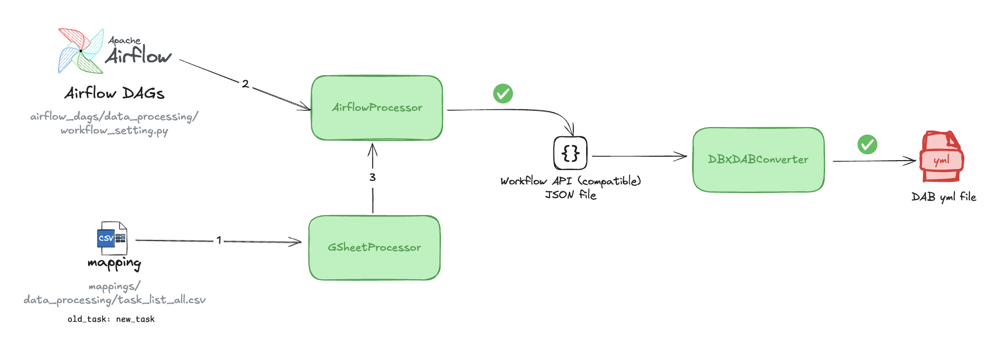

# WFX - Workflow Migration Utility For Databricks

A tool for migrating Airflow DAGs to Databricks Asset Bundles (DABs).


## Overview

WFX streamlines the migration process from Airflow to Databricks by automatically converting Apache Airflow DAG configurations into Databricks Asset Bundle YAML files. The tool preserves the DAG's structure, dependencies, and parameters while adapting them to the Databricks workflow format.

## Project Structure

```
wfx/
├── configs/                          # Cluster configuration
│   └── clusters/                     # Databricks cluster specifications
│       ├── dev.json                  # Development cluster config example
│       └── prod.json                 # Production cluster config example
├── inputs/
│   ├── airflow_dags/                 # Source Airflow DAG files
│   │   └── data_processing/          # Example Airflow DAG directory
│   │       └── workflow_setting.py   # Sample Airflow DAG
│   ├── dbx_workflows/                # Workflow API compatible JSON
│   │   └── data_processing_tasks_config.json  # Generated task config json
│   └── mappings/                     # Task mappings from Airflow to Databricks
│       └── data_processing/          # Example DAG mapping directory
│           └── task_list_all.csv     # CSV mapping old Airflow tasks to new Databricks tasks
├── resources/
│   └── jobs/                         # Output DABs YAML files
│       └── sample_databricks_etl.yml # Generated Databricks workflow yml
├── src/
│   └── wfx/
│       ├── constants/                # Global settings
│       │   ├── __init__.py
│       │   └── settings.py           # Path configurations and constants
│       ├── core/                     # Core conversion logic
│       │   ├── __init__.py
│       │   └── converter.py          # DABs converter
│       └── processors/               # Input processors
│           ├── __init__.py
│           ├── airflow.py            # Airflow DAG parser
│           └── gsheet.py             # Mapping file reader
└── notebooks/                        # Jupyter notebooks for interactive use
    └── playbook.ipynb                # Playbook / Sample conversion notebook
```

## Features

- **Task Dependency Preservation**: Maintains the exact dependency structure of Airflow DAGs
- **Parameter Mapping**: Converts Airflow task parameters to Databricks notebook parameters
- **Flexible Configuration**: Supports customization via mapping files (input task name, output task name, filepaths)
- **Support for Multiple Task Types**: Handles various Databricks task types (notebook, Python, SQL, etc.)
- **CLI Interface**: Easy-to-use command line tool + Python playbook (notebook)

## Installation

### Prerequisites

- Python 3.11+
- Poetry (for dependency management)

### Setup

1. Clone the repository:
   ```bash
   git clone https://github.com/afaqueahmad7117/wfx.git
   cd wfx
   ```

2. Install dependencies:
   ```bash
   poetry install
   ```

3. Activate the Poetry environment:
   ```bash
   poetry shell
   ```

4. Verify installation:
   ```bash
   dabconvert --help
   ```

## Usage

### Command Line

The tool is used as a command-line utility:

```bash
dabconvert -i ALL_DAGs_DIR \
           -d DAG_NAME_DIR \
           -o OUTPUT_DIR \
           -w OUTPUT_WORKFLOW_NAME \
           -c CONFIG_PATH
```

Make sure you've activated the Poetry environment with `poetry shell` before running the command.

### Command Line Arguments

| Short Form | Long Form         | Description                                    |
|------------|-------------------|------------------------------------------------|
| `-i`       | `--input-dir`     | Directory containing Airflow DAG definitions   |
| `-d`       | `--dag-name`      | Name of the DAG to convert                     |
| `-o`       | `--output-dir`    | Directory to write the Databricks workflow YAML|
| `-w`       | `--workflow-name` | Name of the output workflow file               |
| `-c`       | `--config`        | Path to the mapping file (CSV format)          |

Example with short form arguments: 

```bash
dabconvert -i inputs/airflow_dags -d data_processing \
           -o resources/jobs -w sample_databricks_etl \
           -c inputs/mappings/data_processing/task_list_all.csv
```

### Mapping File Format

The mapping file should be a CSV with the following columns:

```
CURRENT_WORKFLOW_NAME,OLD_TASK_NAME,NEW_TASK_NAME,NEW_GIT_PATH,DATABRICKS_WORKFLOW_NAME
data_processing,validate_input_data,data_validation_task,/repos/data_team/etl/validation,sample_databricks_etl
```

## Example

The repository comes with a complete working example that you can use as a reference.

### Sample Files Location

- **Input Airflow DAG**: `inputs/airflow_dags/data_processing/workflow_setting.py`
- **Task Mapping File**: `inputs/mappings/data_processing/task_list_all.csv`
- **Generated JSON**: `inputs/dbx_workflows/data_processing_tasks_config.json`
- **Output DABs YAML**: `resources/jobs/sample_databricks_etl.yml`

### Input Airflow DAG Example

```python
validate_input_data = BashOperator(
    task_id="validate_input_data",
    bash_command='echo "Checking input data..." && sleep 5',
    dag=dag,
)

process_data = PythonOperator(
    task_id="process_data", python_callable=process_data, provide_context=True, dag=dag
)

export_processed_data = BashOperator(
    task_id="export_processed_data",
    bash_command='echo "Exporting processed data..." && sleep 5',
    dag=dag,
)

generate_report = BashOperator(
    task_id="generate_report",
    bash_command='echo "Generating report..." && sleep 5',
    dag=dag,
)

validate_input_data >> process_data >> [export_processed_data, generate_report]
```

### Output Databricks Workflow YAML Example

```yaml
resources:
  jobs:
    sample_databricks_etl:
      name: sample_databricks_etl
      tasks:
      - task_key: data_validation_task
        depends_on: []
        notebook_task:
          notebook_path: /repos/data_team/etl/validation
          source: WORKSPACE
      - task_key: data_processing_task
        depends_on:
        - task_key: data_validation_task
        notebook_task:
          notebook_path: /repos/data_team/etl/processing
          source: WORKSPACE
      - task_key: data_export_task
        depends_on:
        - task_key: data_processing_task
        notebook_task:
          notebook_path: /repos/data_team/etl/export
          source: WORKSPACE
      - task_key: report_generation_task
        depends_on:
        - task_key: data_processing_task
        notebook_task:
          notebook_path: /repos/data_team/etl/reporting
          source: WORKSPACE
```

## Interactive Development

The repository includes a sample Jupyter notebook that demonstrates the conversion process step by step. You can use it for interactive development and testing:

```bash
cd notebooks
jupyter notebook playbook.ipynb
```

This notebook shows:
1. How to setup the input Airflow DAG and paths
2. Specify all the parameters (input dag path, dag name, workflow name, DAB yml output path )
3. How to generate Databricks workflow json (Workflow API compatible)
4. How to convert it to DAB compatible YAML format

## Contributing

1. Fork the repository
2. Create a feature branch: `git checkout -b feature/my-feature`
3. Commit your changes: `git commit -m 'Add my feature'`
4. Push to the branch: `git push origin feature/my-feature`
5. Submit a pull request
